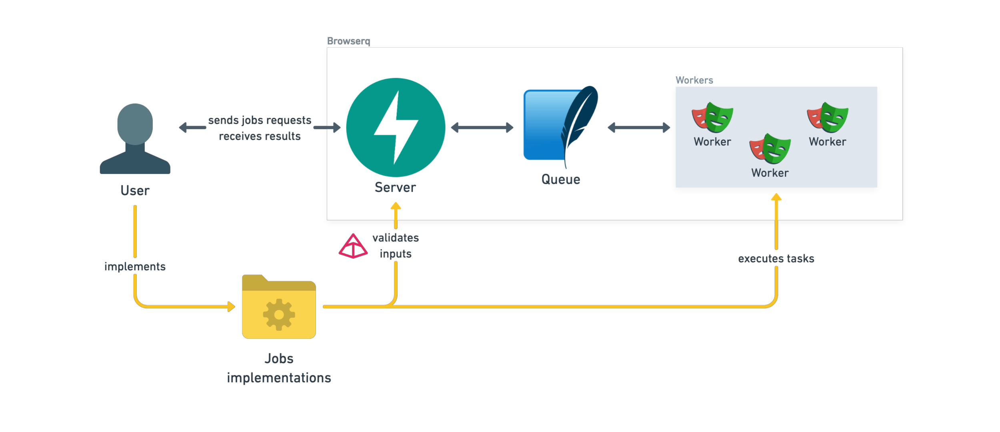

<div align="center">
  <h1>browsy</h1>
</div>

## What is browsy?

browsy is a service that lets you run browser automation tasks without managing browser instances yourself. It provides:

- **Simple Job Definition**: Write Playwright-powered automation tasks in Python
- **HTTP API**: Queue jobs and retrieve results through HTTP endpoints
- **Docker Ready**: Run everything in containers without worrying about browser dependencies
- **Queue System**: Jobs are processed in order, with automatic retries and status tracking
- **Extensible**: Create any browser automation task - from screenshots and PDFs to complex scraping operations

Think of it as a way to turn your Playwright scripts into HTTP services that can be called from anywhere.

## Quick Start

### Download files

To get started, download the necessary files using the following script:
```bash
curl -LsSf https://raw.githubusercontent.com/mbroton/browsy/main/scripts/get.sh | sh
```

This script will download the `docker-compose` file and example jobs. Once downloaded, navigate to the `browsy/` directory.

Alternatively, you can clone the repository directly and navigate to the quickstart directory.

### Start browsy

To start the service, run:
```bash
docker compose up --build --scale worker=3
```

You can adjust the number of workers by modifying the `--scale worker` parameter. 

Visit `http://localhost:8000/docs` to access the interactive API documentation provided by FastAPI.

### Defining custom jobs

A job is defined as any class that inherits from `browsy.BaseJob`. Browsy will automatically search for these classes within the `jobs/` directory.

Here's an example implementation:
```python
from browsy import BaseJob, Page

class ScreenshotJob(BaseJob):
    NAME = "screenshot"

    url: str | None = None
    html: str | None = None
    full_page: bool = False

    async def execute(self, page: Page) -> bytes:
        if self.url:
            await page.goto(self.url)
        elif self.html:
            await page.set_content(self.html)
        return await page.screenshot(full_page=self.full_page)

    async def validate_logic(self) -> bool:
        return bool(self.url) != bool(self.html)
```

- **Class Definition**: The `ScreenshotJob` class inherits from `BaseJob`, which itself is based on Pydantic's `BaseModel`. This provides automatic data validation and serialization.
- **Job Name**: The `NAME` attribute uniquely identifies the job type when making API calls.
- **Parameters**: Defined as class attributes, these are automatically validated by Pydantic during API calls. This ensures that input data meets the expected types and constraints before processing.
- **Validation Logic**: The `validate_logic` method runs during API calls to verify that the job's input parameters satisfy specific conditions. This validation occurs before the job is submitted for execution, allowing for early detection of configuration errors.
- **Execution Method**: The `execute` method carries out the browser automation using a Playwright `Page` object. Workers use this method to execute jobs.

Refer to [Playwright's documentation](https://playwright.dev/python/docs/api/class-page) for more details on what you can do with `page`.

### Client

To interact with the service using Python, you can use browsy client:
```bash
pip install browsy
```

Here's how you can use it:
```python
from browsy import BrowsyClient

client = BrowsyClient("http://127.0.0.1")
job_id = client.submit_job("screenshot", {
    "url": "https://example.com",
    "full_page": True
})
screenshot = client.get_result(job_id=job_id)

with open("screenshot.png", "wb") as f:
    f.write(screenshot)
```

This example demonstrates how to submit a screenshot job, retrieve the result, and save it locally.

## How it works



1. You define jobs using Playwright's API
2. Send job requests through HTTP
3. Workers execute jobs in Docker containers
4. Get results when ready

## Documentation

For detailed setup and usage, check out the [documentation](https://broton.dev/).

## License

MIT License - see [LICENSE](LICENSE) for details.
